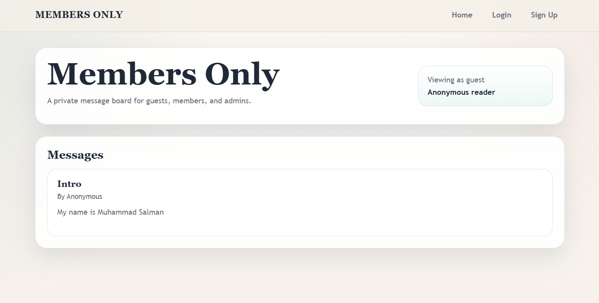
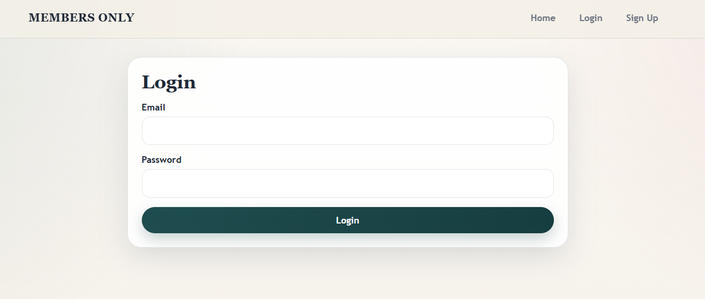
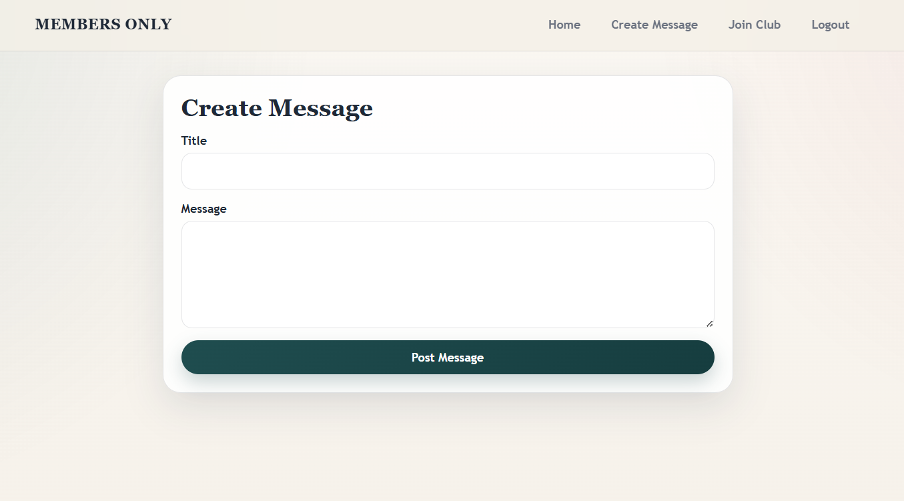

# Members Only

[](https://nodejs.org/)
[](https://expressjs.com/)
[](https://www.postgresql.org/)
[](https://www.passportjs.org/)
[](https://opensource.org/licenses/MIT)

Members Only is a private message board built as part of The Odin Project's Node.js curriculum. It demonstrates secure authentication, session-based access control, and role-based authorization using a clean MVC architecture.

Visitors can browse public messages anonymously, while registered users can log in, join the club, and create new posts. Members see message authors and timestamps, and admins can remove posts from the board. The app uses PostgreSQL for persistence, Passport.js for authentication, and server-side validation to keep the experience secure and predictable.

---

## Live Demo

Live Demo: https://your-live-demo-url.com

---

## Preview





---

## Features

- [x] Secure User Authentication
- [x] Password Hashing with bcrypt
- [x] PostgreSQL Database
- [x] Passport.js Authentication
- [x] Express Sessions
- [x] Role-Based Authorization
- [x] Member-Only Content
- [x] Admin Dashboard
- [x] Create Messages
- [x] Delete Messages
- [x] Responsive Interface
- [x] Input Validation
- [x] MVC Architecture
- [x] Environment Variables
- [x] Secure SQL Queries

---

## Built With

| Technology | Purpose |
| --- | --- |
| Node.js | Server-side runtime |
| Express.js | HTTP server and routing |
| PostgreSQL | Relational database for users, sessions, and messages |
| pg | PostgreSQL client for Node.js |
| Passport.js | Authentication middleware |
| Passport Local Strategy | Email and password login flow |
| express-session | Session management |
| connect-pg-simple | Stores sessions in PostgreSQL |
| bcryptjs | Hashes and compares passwords securely |
| express-validator | Validates and sanitizes form input |
| EJS | Server-rendered views |
| HTML5 | Semantic page structure |
| CSS3 | Responsive styling and layout |
| JavaScript | Application logic |
| dotenv | Loads environment variables |
| nodemon | Development server restart workflow |

---

## Project Structure

<details>
<summary>View folder tree</summary>

```text
members-only/
├── app.js
├── config/
│   └── passport.js
├── controllers/
│   ├── authController.js
│   ├── homeController.js
│   ├── membershipController.js
│   └── messageController.js
├── db/
│   ├── pool.js
│   └── queries.js
├── middleware/
│   └── authMiddleware.js
├── public/
│   └── css/
│       └── style.css
├── routes/
│   ├── authRouter.js
│   ├── membershipRouter.js
│   └── messageRouter.js
├── views/
│   ├── partials/
│   │   ├── footer.ejs
│   │   ├── formErrors.ejs
│   │   ├── head.ejs
│   │   └── navbar.ejs
│   ├── becomeAdmin.ejs
│   ├── index.ejs
│   ├── join.ejs
│   ├── login.ejs
│   ├── newMessage.ejs
│   └── sign-up.ejs
├── package.json
└── README.md
```

</details>

---

## Database Schema

Members Only uses two primary application tables:

- `users` stores account data, hashed passwords, and role flags.
- `messages` stores message content and links each post to a user.

### Users Table

| Column | Purpose |
| --- | --- |
| `id` | Primary key |
| `first_name` | User first name |
| `last_name` | User last name |
| `username` | Login identifier, stored as email |
| `password` | Hashed password |
| `membership_status` | Marks a user as a club member |
| `is_admin` | Grants admin privileges |

### Messages Table

| Column | Purpose |
| --- | --- |
| `id` | Primary key |
| `title` | Message title |
| `text` | Message body |
| `created_at` | Creation timestamp |
| `user_id` | Foreign key to `users.id` |

### Relationship

```text
Users (1) -------- (<) Messages
```

Each user can create many messages, and every message belongs to exactly one user.

---

## Installation

1. Clone the repository:

	```bash
	git clone https://github.com/your-username/members-only.git
	```

2. Move into the project folder:

	```bash
	cd members-only
	```

3. Install dependencies:

	```bash
	npm install
	```

4. Create the PostgreSQL database and tables using your preferred SQL client.

5. Add your environment variables in a local `.env` file.

---

## Environment Variables

Create a `.env` file in the project root with the following values:

```env
DB_HOST=
DB_USER=
DB_PASSWORD=
DB_NAME=
DB_PORT=
SESSION_SECRET=
CLUB_PASSCODE=
ADMIN_PASSCODE=
```

---

## Running Locally

Start the development server:

```bash
npm run dev
```

Start the production server:

```bash
npm start
```

---

## Usage

1. Register a new account with your name, email, and password.
2. Log in with your registered credentials.
3. Join the club by entering the secret club passcode.
4. Become an admin by entering the admin passcode.
5. Create new messages from the authenticated message form.
6. View author names and timestamps as a member or admin.
7. Delete messages as an admin.
8. Log out when finished.

---

## Security Features

<details>
<summary>Security overview</summary>

- `bcryptjs` hashes passwords before they are stored in the database.
- `Passport.js` handles local authentication with the Passport Local Strategy.
- `express-session` keeps users signed in across requests.
- `connect-pg-simple` stores session data in PostgreSQL.
- Parameterized SQL queries reduce the risk of SQL injection.
- `express-validator` validates and sanitizes incoming form data.
- Environment variables keep secrets out of source code.
- Route guards protect member-only and admin-only pages.

</details>

---

## Future Improvements

- User profiles
- Edit messages
- Profile pictures
- Rich text editor
- Pagination
- Search
- Dark mode
- Email verification
- Password reset
- Docker support

---

## Learning Outcomes

Building Members Only strengthened my understanding of:

- Express.js routing and middleware
- PostgreSQL schema design and relationships
- Passport.js authentication flows
- Authentication and authorization separation
- bcrypt password hashing
- Session-based login persistence
- MVC architecture in a real project
- SQL relationships between users and messages
- Input validation with express-validator

---

## License

This project is licensed under the MIT License.

---

## Acknowledgements

- The Odin Project
- Express Documentation
- Passport.js Documentation
- PostgreSQL Documentation
